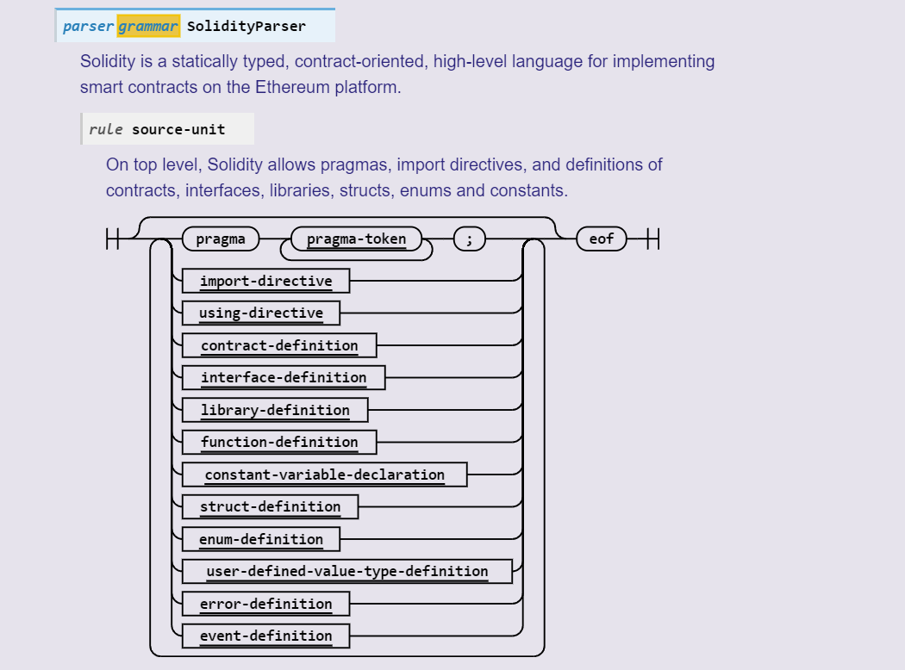
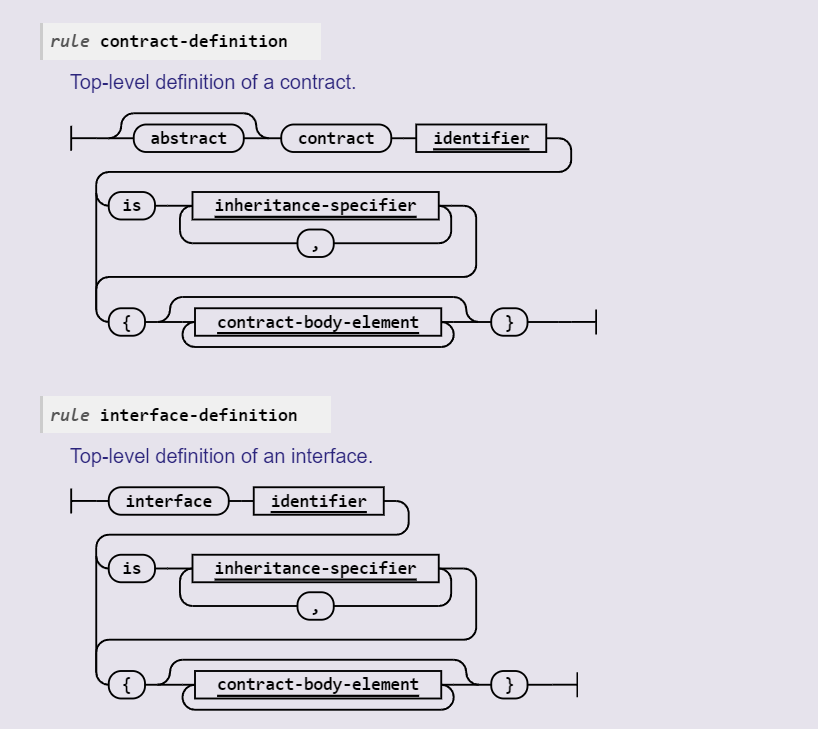
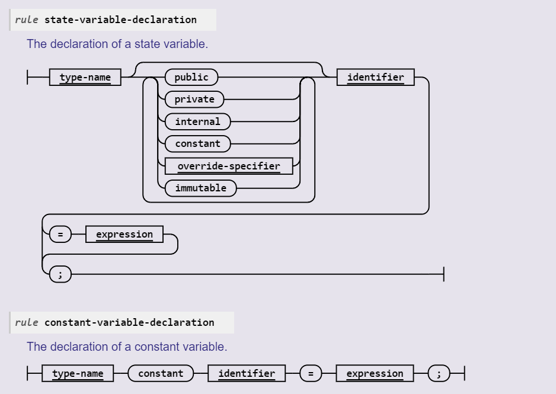

# Week1 - Intro to Blockchain


### Installing Solidity with the most recent changes

```sh
sudo snap install solc --edge
```

### SPDX License Identifier: MIT
```solidity
//SPDX-License-Identifier: MIT
pragma solidithy ^0.5.2 // -> Indicates 0.5.2 above to less than 0.6.0
```

The version pragma is used as follows: pragma solidity ^0.5.2;

A source file with the line above does not compile with a compiler earlier than version 0.5.2, and it also does not work on a compiler starting from version 0.6.0 (this second condition is added by using ^). Because there will be no breaking changes until version 0.6.0, you can be sure that your code compiles the way you intended. The exact version of the compiler is not fixed, so that bugfix releases are still possible.

### Hitting the compile button in remix
Compile -> Bytecode & ABI -> Deploy.

Interaction with ABI

Code wont be uploaded in the blockchain but the bytecode we generate.
Metamask is interacting with the bllockchain to sign the transaction.

### Code Reference -Day 1

```solidity
//SPDX-License-Identifier: GPL-3.0
pragma solidity >=0.7.0 <0.9.0;

contract HelloWorld {
    constructor() {

    }

    function helloworld() public view returns (string memory) {}
}

```
## Day 2

### Layout of a Contract
* **Visit Layout of a Solidity File** : https://docs.soliditylang.org/en/latest/grammar.html





**Contract Definition**
* abstract has a branch above that means abstract is optional
*  contract has no branching option so it cant be overriden
* identifier is dashed so it can be given any name
* is is used for Inheritance
* contract_body_element is optional but is usually required

### State Variables
https://docs.soliditylang.org/en/latest/structure-of-a-contract.html#state-variables

Variables stored permanently in contract storage.

```solidity
// SPDX-License-Identifier: GPL-3.0
pragma solidity >=-0.4.0 <0.9.0

contract SimpleStorage {
    uint storedData; // this is permanently stored
}
```

**Persistence Variable** -> state variable even if the computer gets off it is still there in other language



**constructor**
runs on deployment of the contract

```solidity
string private text = "Hello World";
constructor(string memory myInitialText) {
    text = "Something";
    text = myInitialText;
}
```

**Function**

each function is a transaction 
there are paid and non-paid transaction and is dormant that is they are executed only when we call them.
4 Bytes are used as function selectors and is the number of function limit inside a contract
```solidity
function helloworld() public view returns (string memory) {
    return text;
}

/* state change happening in the below function */
function setText(string memory newText) public {
    text = newText;
}
```

first function is pure . 

function setText(string memory newText) **public**

public is the accessibility of the function

***Function Modifier***https://docs.soliditylang.org/en/latest/structure-of-a-contract.html#function-modifiers

external and public are only callable from outside
***below code will throw an error***
```solidity
function setText(string memory newText) external {
    text = newText;
}
//-> this is will throw an error
function setStringText(string memory newText) external {
    setText(newText);
}
```

```solidity
function setText(string memory newText) public {
    text = newText;
}
/* this is allowed */
function setStringText(string memory newText) external {
    setText(newText);
}
```
***Visibility***
***external function***
in the first example , the external***setText***function is only callable from outside the contract but it cant be called from inside the contract

***public function***
in the second example, the since***setText***is a function that is public it can be called both outside and inside the contract.


***Visibility of state Variables***
* private
* Internal
* public
***public***state variable always get a getter function for the variable

**internal** & **private** are both not allowed to be called outside the contract the only difference is that **internal** can only be accessed within the contract. 

internal or private variables will be visible to the outside world but the only difference is that no one can change or modify the information.

***State Mutability***

The default mutability***non-payable***is assumed if no mutability is mentioned.
All the options are 

* non-payable -> default
* pure
* view
* payable

```solidity
// non-payable pay for state transition
contract HelloWorld {
    uint internal viewCount; 
    function helloWorld() public view returns (string memory) {
        viewCount++;
        returns viewCount;
    }
}

// dont have to pay for view function as it doesn't mutate state
contract HelloWorld {
    uint internal viewCount; 
    function helloWorld() public view returns (string memory) {
        returns viewCount;
    }
}

// dont have to pay for view function as it doesn't mutate state
contract HelloWorld {
    uint internal viewCount; 
    function helloWorld() public view returns (string memory) {
        returns viewCount;
    }
}
// pure function
contract HelloWorld {
    uint internal viewCount; 
    function helloWorld() public pure returns (string memory) {
        //return viewCount; -> this will not work since pure cant access state of blockchain
        returns "ABC";
    }
}

//payable
contract Helloworld{
    uint internal viewCount;
    function helloWorld() public pure returns (string memory) {
        //return viewCount; -> this will not work since pure cant access state of blockchain
        returns "ABC";
    }
}
```
approval and gas is required for non-payable

we dont use source code to interact with the contract but an interface.

function in interface has to be external.***Interface function can't be put public***.
Although inside the contract using the interface the function can be public.

Once deployed we don't need the contract code to interact with the contract. only interface and the address it is deployed is enough to interact with the contract.

```solidity

//SPDX-License-Identifier: GPL-3.0
pragma solidity >=0.7.0 <0.9.0;
interface HelloWorldInterface {
    function helloworld() external view returns (string memory);
    function setText(string memory newText) external;
}

contract HelloWorld is HelloWorldInterface {

    uint storedData; // State Variable
    string private text = "Hello World";
    constructor(string memory myInitialText) {
        text = "Something";
        text = myInitialText;
    }

    function helloworld() public view returns (string memory) {
        return text;
    }
    function setText(string memory newText) public {
        text = newText;
    }
}
```


***Abnormalities in Interface***

```solidity

//SPDX-License-Identifier: GPL-3.0
pragma solidity >=0.7.0 <0.9.0;
interface HelloWorldInterface {
    function helloworld() external view returns (string memory);
    function setText(string memory newText) external;
    function potato(string memory newText) external view returns (string memory);
}
```

there is no error while compiling but while calling it throws a gas estimation error since the deployed contract doesnt have the function.

***payable***

```solidity

contract HelloWorld is HelloWorldInterface {

    uint storedData; // State Variable
    string private text = "Hello World";
    constructor(string memory myInitialText) {
        text = "Something";
        text = myInitialText;
    }

    function helloworld() public view returns (string memory) {
        return text;
    }
    function setText(string memory newText) payable public {
        text = newText;
    }
}
```

Doesn\'t require payment but accepts payment.

we cant send money to a function that is non-payable but we send only the gas to change the state of blockchain.


```solidity

contract HelloWorld is HelloWorldInterface {

    uint storedData; // State Variable
    string private text = "Hello World";
    constructor(string memory myInitialText) {
        text = "Something";
        text = myInitialText;
    }

    function helloworld() public view returns (string memory) {
        return text;
    }
    function setText(string memory newText) payable public {
        require(msg.value > 2 ether ); // we can also so this
        text = newText;
    }
}
```

see style guide in docs.solidity

***

# Day 3

signing the contract 0xfunc.selector-data

### Account
Each account has a data area called storafe , which is persistent accross function calls and transactions . Storage is a key-value store that maps 256 bit words to 254-bit words. It is possible to enumerate storage from within a contract.

Every smart contract has 2^256 spaces to store value of size 256 bits.

If we send a transaction bigger than 256 text. what would happen?
0x(4-byte-func.selector)all-account-data
the account data is divided into 
* size
* pointer
* data
is sent as it doesnt fit 256 bytes. 

***

### Storage Memory and the Stack

***storage-state variables***
Each account has a data area called storage, which is **persistent** between function calls and transactions. Storage is a key-value store that maps 256-bit words to 256-bit words. It is not possible to enumerate storage from within a contract, it is comparatively costly to read, and even more to initialise and modify storage. Because of this cost, you should minimize what you store in persistent storage to what the contract needs to run. Store data like derived calculations, caching, and aggregates outside of the contract. A contract can neither read nor write to any storage apart from its own.

2^256 length array where each element is u256

***memory***
memory starts with all zeroes.This is not persistent.

The second data area is called memory, of which a contract obtains a freshly cleared instance for each message call. Memory is linear and can be addressed at byte level, but reads are limited to a width of 256 bits, while writes can be either 8 bits or 256 bits wide. Memory is expanded by a word (256-bit), when accessing (either reading or writing) a previously untouched memory word (i.e. any offset within a word). At the time of expansion, the cost in gas must be paid. Memory is more costly the larger it grows (it scales quadratically).


***stack***
part of the EVM handling shrinking and expansion of object. receive data as calldata to parameter of function
calldata is being sent so it is better to do 
```solidity
function setText(string calldata newText) public {
    text = newText;
}
```
than 
```solidity
function setText(string memory newText) public {
    text = newText;
}
```
since in latter memory is copied to calldata.

disadvantage of calldata is that you have to use as it is , you cant change the calldata variable

```solidity
function setText(string calldat newText) public {
    newText = "AAA"; // -> this is not allowed. you need to make it a memory
    text = newText;
}
```


The EVM is not a register machine but a stack machine, so all computations are performed on a data area called the stack. It has a maximum size of 1024 elements and contains words of 256 bits. Access to the stack is limited to the top end in the following way: It is possible to copy one of the topmost 16 elements to the top of the stack or swap the topmost element with one of the 16 elements below it. All other operations take the topmost two (or one, or more, depending on the operation) elements from the stack and push the result onto the stack. Of course it is possible to move stack elements to storage or memory in order to get deeper access to the stack, but it is not possible to just access arbitrary elements deeper in the stack without first removing the top of the stack.

### Interface
```solidity
// SPDX-License-Identifier: GPL-3.0
pragma solidity >=0.7.0 <0.9.0;

contract HelloWorld {
    string private text;

    constructor() {
        text = "Hello World";
    }

    function helloWorld() public view returns (string memory)  {
        return text;
    }

    function setText(string calldata newText) public {
        text = newText;
    }
}

contract HelloWorldExtension {}
```
if we deploy HelloWorldExtension then also the functions in HelloWorld is present in the new contract.


```solidity
// SPDX-License-Identifier: GPL-3.0
pragma solidity >=0.7.0 <0.9.0;

contract HelloWorld {
    string private text;

    constructor() {
        text = initialText;
    }

    function helloWorld() public view returns (string memory)  {
        return text;
    }

    function setText(string calldata newText) public {
        text = newText;
    }

    function initialText() pure returns (string memory) {
        return "init";
    }
}

contract HelloWorldExtension {}
```

```solidity
// SPDX-License-Identifier: GPL-3.0
pragma solidity >=0.7.0 <0.9.0;

contract HelloWorld {
    string private text;

    constructor() {
        text = initialText;
    }

    function helloWorld() public view returns (string memory)  {
        return text;
    }

    function setText(string calldata newText) public {
        text = newText;
    }

    function initialText() pure returns (string memory) {
        return "init";
    }
}

contract HelloWorldExtension {
    // not allowed
    function initialText() pure returns (string memory) {
        return "init";
    }
}
```


```solidity
// SPDX-License-Identifier: GPL-3.0
pragma solidity >=0.7.0 <0.9.0;

contract HelloWorld {
    string private text;

    constructor() {
        text = initialText;
    }

    function helloWorld() public view returns (string memory)  {
        return text;
    }

    function setText(string calldata newText) public {
        text = newText;
    }

    function initialText() pure returns (string memory) {
        return "init";
    }
}

contract HelloWorldExtension {
    // not allowed
    function initialText() pure returns (string memory) {
        return "Hello, There";// Not allowed
    }
}
```
***Only this way is allowed***
```solidity
// SPDX-License-Identifier: GPL-3.0
pragma solidity >=0.7.0 <0.9.0;

contract HelloWorld {
    string private text;

    constructor() {
        text = initialText;
    }

    function helloWorld() public view returns (string memory)  {
        return text;
    }

    function setText(string calldata newText) public {
        text = newText;
    }

    function initialText() vitual returns (string memory) {
        return "init";
    }
}

contract HelloWorldExtension {
    // not allowed
    function initialText() override returns (string memory) {
        return "Hello, There";// Not allowed
    }
}
```
***Only this way is allowed***
```solidity
// SPDX-License-Identifier: GPL-3.0
pragma solidity >=0.7.0 <0.9.0;

contract HelloWorld {
    string private text;

    constructor() {
        text = initialText;
    }

    function helloWorld() public view returns (string memory)  {
        return text;
    }

    function setText(string calldata newText) public {
        text = newText;
    }

    function initialText() vitual returns (string memory) {
        return "init";
    }
}

contract HelloWorldExtension {
    // not allowed
    function initialText() override returns (string memory) {
        return "Hello, There";// Not allowed
    }
}
```
super function cannot be private for this ability only virtual to allow it to be overriden..

***require v/s assert***

revert(require/assert) takes gas is it i sincluded in block of blockchain and transaction has to be reverted so upto that point the gas needs to be paid
assert is more dramatic panics with error. 

**modifier**
```solidity
modifier onlyWhennTextChanged() {
    require(textHasChanged());
    _;
    do something after;
}
function restore() public onlyWhenTextChanged returns (bool) {
    return true;
}
```
**both are the same**
```solidity

function restore() public returns (bool) {
    require(textHasChanged);
    return true;
    do something after;
}
```

**Global Variable look in docs**
ex. msg.sender, msg.data, wei , gwei = 10^9 wei, ether =  10^9 gwei, block.timestamp.
we could want bloc.timestamp >= 2 years

***
# Week 4
addr.call(abi.encodeWithSignature("transfer(address,uint256)",0xSomeAddress, 123))

1st 4 bytes returned from the abi.encodeWithSignature(...) is the function selector.

keckac256 is there in solidity

IHelloWorld(target_address).function();